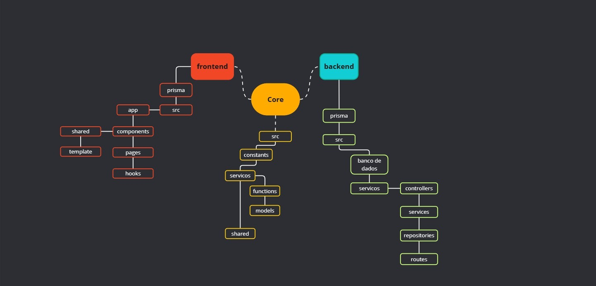

# Projeto em equipes
O objetivo deste projeto é implementar uma solução robusta de autenticação e autorização, incluindo o gerenciamento de Usuários, Perfis e Permissões. Este sistema deve permitir a administração detalhada de acesso por perfil e permissão, além de possibilitar autenticação por métodos tradicionais e avançados.

## Esboço da arquitetura



<br>
<br>

# Fases do Projeto
### Fase 1: Estrutura Básica de Autenticação
#### Casos de Uso
- **Cadastro de Usuário**: Permitir o registro de novos usuários no sistema.
- **Login de Usuário**: Autenticar o usuário com base em e-mail e senha.
- **Recuperação de Senha**: Enviar um e-mail para recuperação de senha.
- **Alteração de Nome**: Permitir que o usuário altere seu nome dentro do sistema.
- **Alteração de Senha**: Permitir que o usuário altere sua senha dentro do sistema.
- **Logout**: Encerrar a sessão do usuário.
 ```
 Detalhes de Segurança:

  - Persistir senha criptografadas (hash de senha)
  - uso de tokens para sessão
```
### Fase 2: Gerenciamento de Perfis e Permissões
#### Casos de Uso
- **CRUD de Perfis**: Cadastrar, alterar, excluir e listar perfis no sistema.
- **CRUD de Permissões**: Cadastrar, alterar, excluir e listar permissões no sistema.
- **Associação de Perfil ao Usuário**: Associar um ou mais perfis a um usuário.
- **Associação de Permissão ao Perfil**: Vincular permissões a um perfil específico.

### Fase 3: Autenticação e Autorização Avançadas
#### Casos de Uso
- **Login via QR Code**: Permitir que o usuário faça login usando um QR Code escaneado pelo celular.
- **Autenticação de Dois Fatores (2FA)**: Implementar autenticação em dois fatores para aumentar a segurança.
- **Controle de Sessão e Expiração**: Definir tempo de expiração de sessão para aumentar a segurança.
- **Histórico de Login e Atividades do Usuário**: Rastrear atividades de login para segurança e auditoria.
  
### Fase 4: Auditoria e Relatórios [opcional]
#### Casos de Uso
- **Auditoria de Ações de Usuários**: Rastrear ações significativas, como criação e exclusão de usuários ou mudanças de permissões.
- **Relatório de Perfis e Permissões**: Gerar relatórios de perfis e suas permissões.
- **Relatório de Acessos de Usuários**: Exibir relatórios sobre acessos dos usuários.